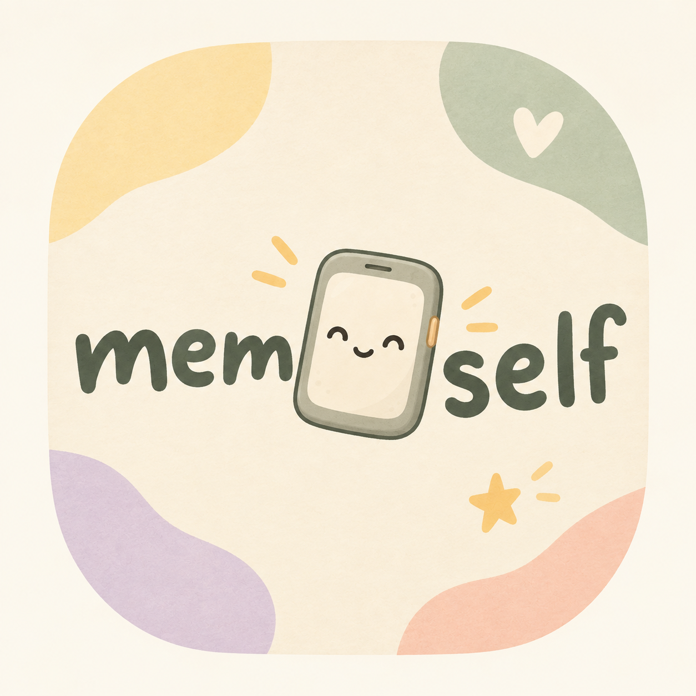

# memoself

*Vibe coded with AI assistance.*

**Memoself** is a personal organizer I designed for my own needs. No subscriptions, no accounts, no ads. Just a calm, beautiful tool that lives on my phone.

---

## ✨ Features

### 📋 Today — Tasks
Recurring tasks: **daily, weekly, monthly or yearly**. Plus **recurring reminders** — every 1 min, 5 min, 30 min, 1 hour, or any custom interval. Tick them off, hear a sound, feel good.

### 📅 Calendar
Notes per day. Add a note to a future date and the app asks if you want a **reminder** — alarm is created automatically.

### 📝 Notes
Title + content. Convert any note to a task in one tap — note disappears, task appears in Today.

### ⏰ Clock
Live clock and alarms with a chime sound. Once, daily, weekdays, or weekends. Works from any tab.

### 📦 More
- **Later** — not now, but don't forget
- **Brain Dump** — dump everything, sort it out after
- **History** — everything completed, with Copy & CSV export
- **Themes** — 6 palettes: Sage, Mint, Blue, Lavender, Terracotta, Midnight
- **Export / Import** — JSON backup & restore
- **Clear All Data** — start fresh

### 🐾 Foni
The app's mascot — a little phone character that changes mood based on your task load.

---

## 📱 Install as an app

### iOS (Safari)
Tap **Share** → **Add to Home Screen**

### Android (Chrome)
Tap **⋮** → **Add to Home Screen**

---

## 🔒 Privacy
Everything stays on your device. No server, no tracking, no cloud.

---

## 🛠️ Tech
Single HTML file · Vanilla JS · PWA · Works offline · No dependencies

---

*Designed with intention. Built with AI. Made for me.* 🌿
